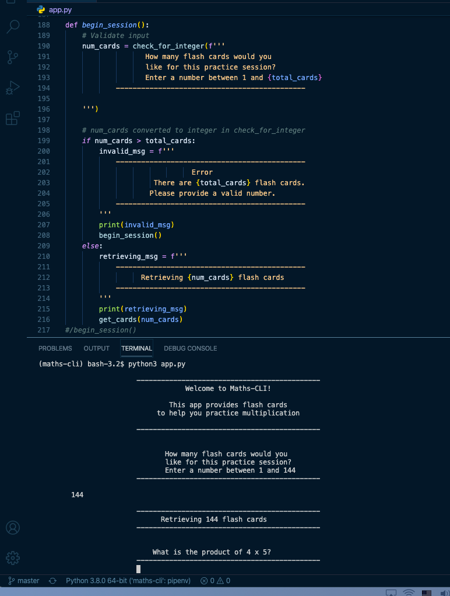

# Maths-CLI

A Python command line application, which provides mathematics flash cards to help a user practice multiplication.

Repo: https://github.com/ThwCorbin/maths-cli

## Description

User runs the Maths-cli app in their terminal to practice the multiplication table (factors 1 through 12). User sets up a practice session with all 144 "flash cards" or selects a subset of cards. User can add multiplicaton flash cards to the database after user's first practice session.

This is my ninth project for [General Assembly's](https://generalassemb.ly/ "General Assembly homepage") Software Engineering Immersive program.

## Technologies

- Python
- PostgreSQL
- PeeWee

## Features

I developed a bronze/silver/gold plan, which is available in the planning directory in this repo. I completed all bronze and silver level features, which includes validation of user input.

## Installation

- Clone the repo
- `cd` to the maths-cli directory
- Install dependencies in the Pipfile with pipenv
- Enter `pipenv shell` in the terminal to create a virtual environment
- Open a separate terminal window and enter `psql`
- At the `=#` prompt, enter `CREATE DATABASE maths;`
- Then enter `\c maths` to connect to the database
- Then enter `\d card` to describe the Card model
- Then enter `SELECT * FROM card;` to view the card table rows
- Back in the virtual environment terminal, enter `python3 seed.py`
- Then enter `python3 app.py` to begin a practice session

## License

[MIT](LICENSE.txt "MIT License text file")
